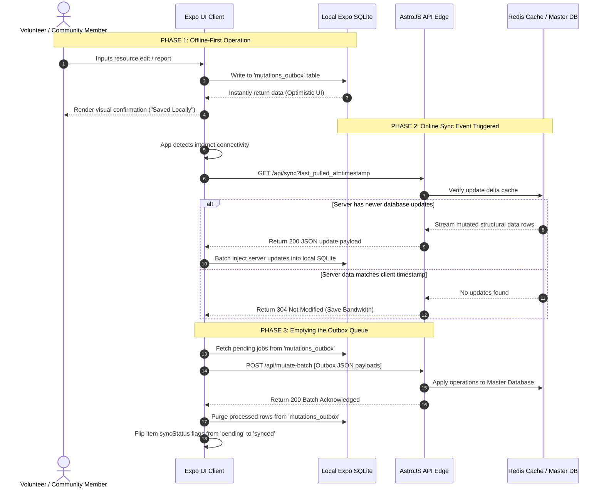

# ADR-001: Local-First Sync Architecture (Data resilience)

## Context
The People's App serves vulnerable demographics requiring offline data access under zero-data environments. Initial proposals leaned on cloud-locked document stores (Firestore), which create cost vulnerabilities tied directly to document-read volumes. We reject this in favor of client-side Expo SQLite tables managed via Drizzle ORM.

## Decision
We will employ a **Local-First Architecture** leveraging **Expo SQLite** orchestrated via **Drizzle ORM** as the primary on-device data platform. The client application will treat local device databases as the exclusive source of truth. 

The server-side layer will use **AstroJS** edge endpoints backed by a **Redis** caching pipeline to serve timestamped delta sync structures (Timestamp Cache). All client modifications will log to a local `mutations_outbox` database table and sync asynchronously upon detecting an active internet connection.

## Technical Implementation Blueprint: Drizzle Schemas

To support this local-first model, the on-device database will implement a relational structure tracking local mutation states and incremental sync timestamps.



### 1. The Sync Metadata Schema
This table tracks the exact Unix timestamp of the last successful sync pull from the AstroJS/Redis server to prevent redundant data fetching.

```typescript
// src/db/schema/syncMetadata.ts
import { sqliteTable, integer, text } from 'drizzle-orm/sqlite-core';

export const syncMetadata = sqliteTable('sync_metadata', {
  id: integer('id').primaryKey({ autoIncrement: true }),
  lastPulledAt: integer('last_pulled_at', { mode: 'timestamp' }).notNull(),
  schemaVersion: text('schema_version').notNull(), // To handle client-side database migrations
});
```

### 2. The Core Resource Schema (Example: Food Banks)
Core application data includes a `syncStatus` flag to handle optimistic UI rendering cleanly.

```typescript
// src/db/schema/resources.ts
import { sqliteTable, text, integer } from 'drizzle-orm/sqlite-core';

export const resources = sqliteTable('resources', {
  id: text('id').primaryKey(), // Server-generated UUID/ULID string
  name: text('name').notNull(),
  address: text('address').notNull(),
  operatingHours: text('operating_hours'),
  updatedAt: integer('updated_at', { mode: 'timestamp' }).notNull(),
  
  // Local-First UI State Flags
  syncStatus: text('sync_status', { enum: ['synced', 'pending_delete', 'pending_update'] }).default('synced').notNull(),
});
```

### 3. The Local Mutations Outbox Schema
Every user-generated update or mutation is stored sequentially in this outbox table first. The synchronization engine iterates over this table when internet connectivity returns.

```typescript
// src/db/schema/mutationsOutbox.ts
import { sqliteTable, integer, text } from 'drizzle-orm/sqlite-core';

export const mutationsOutbox = sqliteTable('mutations_outbox', {
  id: integer('id').primaryKey({ autoIncrement: true }),
  tableName: text('table_name').notNull(),              // e.g., 'resources'
  recordId: text('record_id').notNull(),                // The target row ID
  action: text('action', { enum: ['CREATE', 'UPDATE', 'DELETE'] }).notNull(),
  payload: text('payload').notNull(),                   // JSON string of the exact database mutations
  createdAt: integer('created_at', { mode: 'timestamp' }).notNull(),
});
```


## Consequences
* **Pros:** Complete resilience under air-gapped network conditions; server infrastructure operating costs remain flat and close to zero; zero vendor lock-in.
* **Cons:** Requires manual development of backend synchronization and conflict resolution logic (Last-Write-Wins pattern) on Astro API endpoints.


https://docs.expo.dev/guides/local-first/  
https://www.pkgpulse.com/guides/expo-sqlite-vs-watermelondb-vs-realm-react-native-local-2026  
https://dev.to/sathish_daggula/how-to-build-offline-first-sqlite-sync-in-expo-1lli  
https://github.com/drizzle-team/drizzle-orm/discussions/5135  
https://javascript.plainenglish.io/react-native-2026-mastering-offline-first-architecture-ad9df4cb61ae  
https://www.adaptnxt.com/blogs/building-offline-first-react-native-apps  

